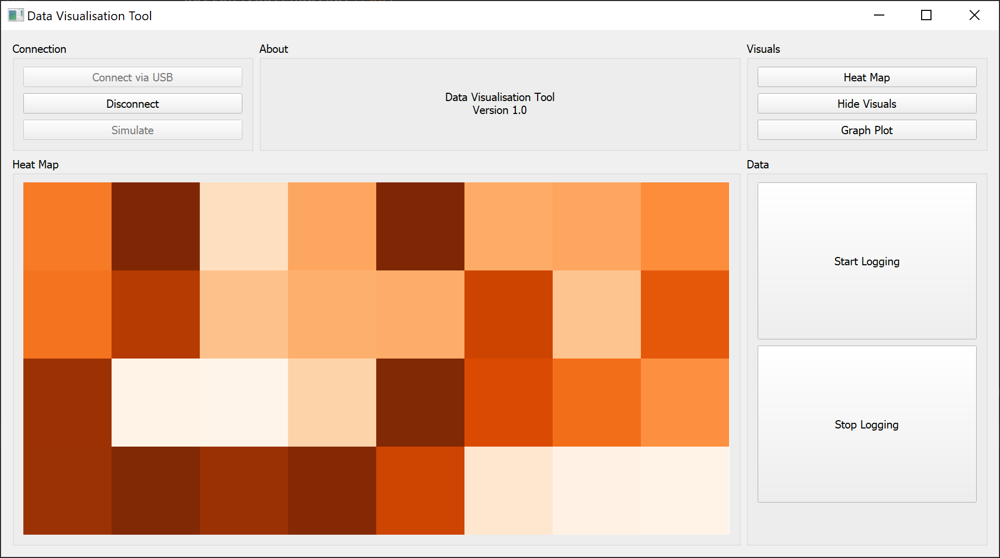
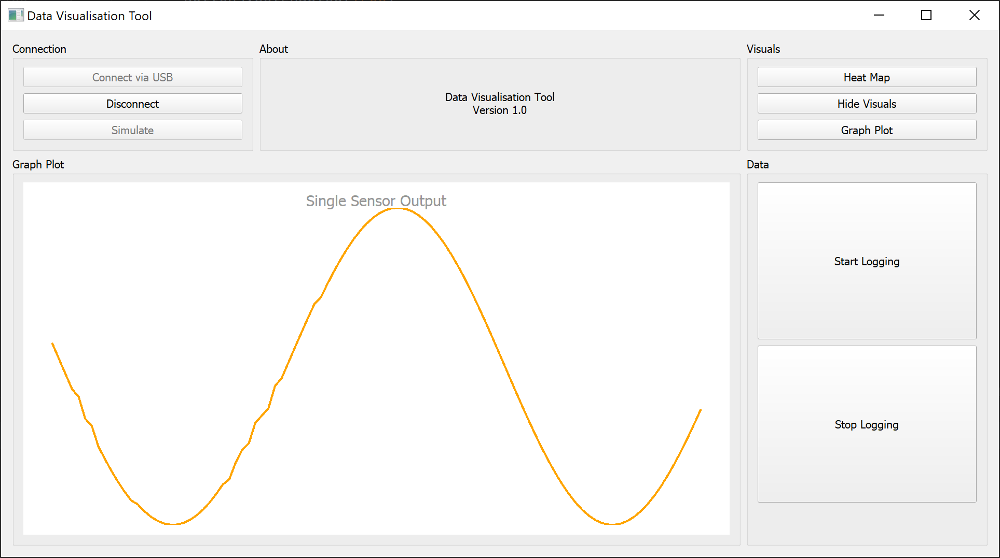

# Serial Data Visualisation Tool

> A GUI for visualising serial data in real-time

 

## Table of Contents

- [General Info](#general-information)  
- [Technologies Used](#technologies-used)  
- [Screenshots](#screenshots)  
- [Contact](#contact)

 
 

## General Information
This repository contains the source code of the data visualisation tool. The data visualisation tool runs locally and
makes use of dedicated GPUs and multicore CPUs for increased performance. Currently, the tool supports data from 
serial COM protocols.

Functionalities of the tool are live heatmap visualisation, live plot visualisations and CSV data logging.

 

## Technologies Used
This tool was created in python and the source code provides a template for implementing the following libraries and 
frameworks.

| Language     | GUI Framework | Data Visualisation   |
|--------------|---------------|----------------------|
| Python 3.7.6 | Pyqt5         | Vispy  Pyqtgraph |

 

## Screenshots
Heatmap Visualisation
 

Graph Visualisation
 

 

## Contact
Created by [@LiamRichardson](https://www.linkedin.com/in/liam-richardson/)
 